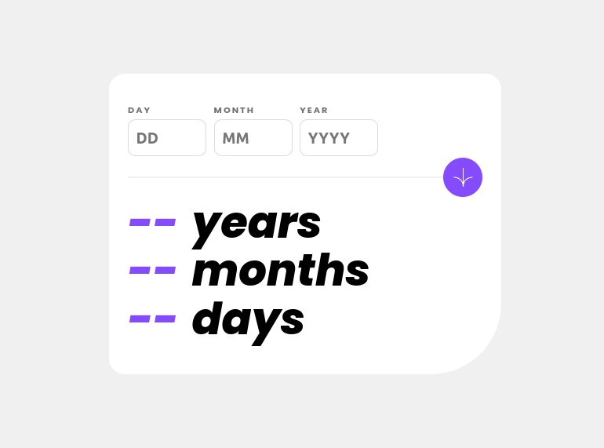

# Frontend Mentor - Age calculator app solution

This is a solution to the [Age calculator app challenge on Frontend Mentor](https://www.frontendmentor.io/challenges/age-calculator-app-dF9DFFpj-Q). Frontend Mentor challenges help you improve your coding skills by building realistic projects. 

## Table of contents

- [Overview](#overview)
  - [The challenge](#the-challenge)
  - [Screenshot](#screenshot)
  - [Links](#links)
- [My process](#my-process)
  - [Built with](#built-with)
  - [What I learned](#what-i-learned)
  - [Continued development](#continued-development)
  - [Useful resources](#useful-resources)
- [Author](#author)

## Overview

### The challenge

Users should be able to:

- View an age in years, months, and days after submitting a valid date through the form
- Receive validation errors if:
  - Any field is empty when the form is submitted
  - The day number is not between 1-31
  - The month number is not between 1-12
  - The year is in the future
  - ~~The date is invalid e.g. 31/04/1991 (there are 30 days in April)~~
- View the optimal layout for the interface depending on their device's screen size
- See hover and focus states for all interactive elements on the page
- ~~**Bonus**: See the age numbers animate to their final number when the form is submitted~~

### Screenshot

### Links

- Live Site URL: [Live project](https://rwxganta.github.io/age-calculator-component/)

## My process

### Built with

- Semantic HTML5 markup
- CSS custom properties
- Flexbox
- Mobile-first workflow
- Moment.js library CDN (with moment-precise-range plugin)

### What I learned

Good come back to JS world, specially using a library for the first time: moment.js.
Gotta keep trying to understand it better.

### Continued development

- Definititely need to inprove on my JS skills. I was lost for quite while on some basic stuff that could be avoided by practicing more.

- Gotta keep looking at the moment.js library (and yes, I know it was kinda "descontinuated") and some other new ones later.

- I initially try to use NPM to install the momentJS library put I find myself stuck in some MODULE stuff that really pissMeOff. So I ended up using it's CDN directly on HTML script tag.

I didn't apply any form validation to this project. Still a really hard topic to wrap my head around. Need a LITTLE more focus on that one .-.

### Useful resources

- [MomentJS Tutorial on Youtube](https://www.youtube.com/watch?v=n80RRNS1k64&list=PLVvjrrRCBy2LWFkR7opQxWp4z0en6OHgw&index=2) -> General understand of the momentJS

## Author

- Website - [Yea, shame on me]()
- Frontend Mentor - [@rwxganta](https://www.frontendmentor.io/profile/rwxganta)
- Twitter - [@rwxganta](https://www.twitter.com/rwxganta)

